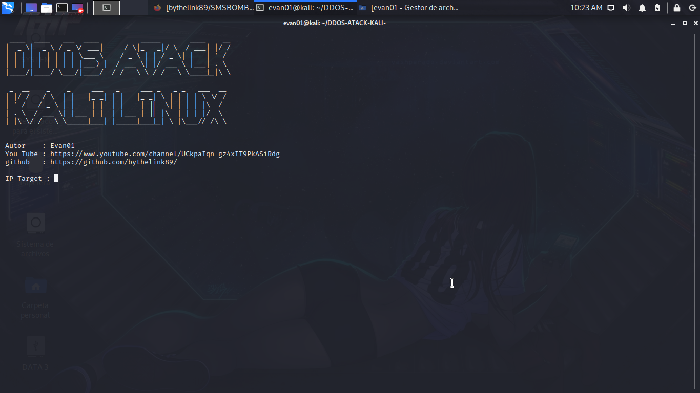
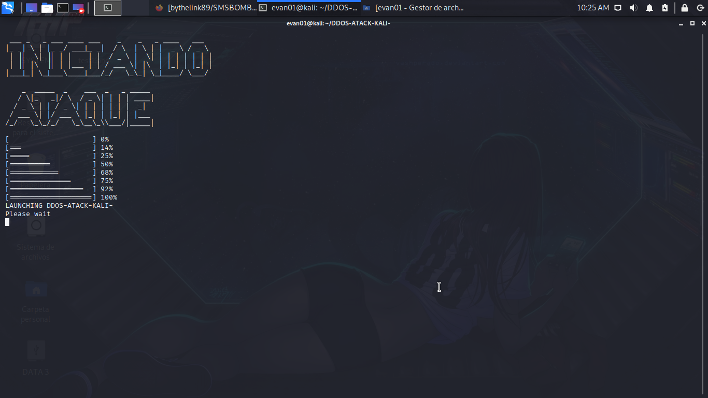

# DDOS-ATACK-KALI-

# TUTORIAL DE USO 

<iframe width="560" height="315" src="https://www.youtube.com/embed/_fXFPljwlHY" frameborder="0" allow="accelerometer; autoplay; clipboard-write; encrypted-media; gyroscope; picture-in-picture" allowfullscreen></iframe>

Este scrip echo en python crea un ataque ddos, lo unico qu enecesita hacer es ingresar la ip de la victima(no red local) y esperar.
Se instala asi

sudo apt-get install python

sudo apt-get install git

git clone https://github.com/bythelink89/DDOS-ATACK-KALI-.git

cd DDOS-ATACK-KALI-                                                                               

python ddos.py 

y despues ahi se iniciara y pondremos nuestros datos.

